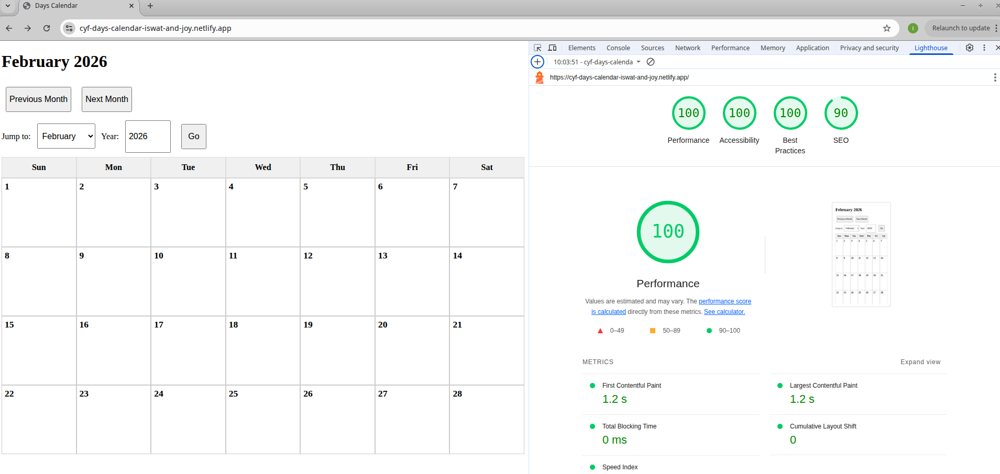

# Piscine-Sprint-2-Project-Days-Calendar

[**View the Live Website**](https://cyf-days-calendar-iswat-and-joy.netlify.app/)

## 📖 About the Project

This project is a **Smart Calendar** designed to display commemorative days that occur annually but change dates every year (for example, Ada Lovelace Day is the second Tuesday of October).

Instead of hard-coding dates, our app reads "rules" from a JSON file and uses a math engine to calculate the exact date for any year between 1900 and 2100.

### Key Features

- **Dynamic Grid:** A 7-column calendar that always starts the week on **Sunday**.
- **Infinite Navigation:** Move forward and backward through time indefinitely or jump to a specific month/year.
- **Smart Holiday Logic:** Automatically calculates dates for holidays (first, second, third, fourth, or last occurrence of a weekday).
- **Timezone Safe:** Built using **UTC logic** to ensure dates never "slip" due to Daylight Savings or different time zones.
- **Interactive UI:** Click on any holiday name to see a popup with a description fetched from an external URL.
- **100% Accessible:** Optimized to hit a perfect **100 score on Lighthouse Accessibility** 

---

## 🛠️ Group Requirements (iCal Generator)

As a group project, we have included a **Node.js iCal Generator**.

- **The Script:** Generates a `days.ics` file.
- **Date Range:** Covers every holiday from the years **2020 to 2030**.
- **Format:** All events are "All-Day" events with no recurring rules (one unique entry per year), making them perfectly compatible with Google Calendar and Apple Calendar.

---

## 🚀 How to Run the Project

### 1. The Web App

Because this project uses JavaScript Modules, you must run it using a local server:

1.  Open the project folder in VS Code.
2.  Use the **Live Server** extension or run `npx http-server` in your terminal.
3.  Open the provided URL (e.g. http://localhost:3000)

### 2. The iCal Generator

To create the `.ics` file:

1.  Open your terminal in the project root.
2.  Run the command:
    ```bash
    npm run generate-ical
    ```
3.  A file named `days.ics` will appear in your folder.

### 3. Running Tests

To verify the math logic:

1.  Run the following command in your terminal:
    ```bash
    npm test
    ```

---

## 📋 Rubric Verification

We have verified the following specific dates as required by the project rubric:

- **October 8, 2024:** Ada Lovelace Day (Correct)
- **October 13, 2020:** Ada Lovelace Day (Correct)
- **October 25, 2024:** World Lemur Day (Correct - Last Friday)
- **May 11, 2030:** International Binturong Day (Correct)
- **February 2026:** Correctly displays as a perfect 4-week block starting on Sunday and ending on Saturday.

---

## 🧰 Tech Stack

- **HTML5:** Semantic structure and `<template>` tags.
- **CSS3:** CSS Grid for the 7-column layout and responsive design.
- **JavaScript (ESM):** Modular logic shared between the web and Node.js.
- **Node.js:** For the iCal file generation.

---

### 🏆 Project Status: Complete & Verified 100% Accessible
